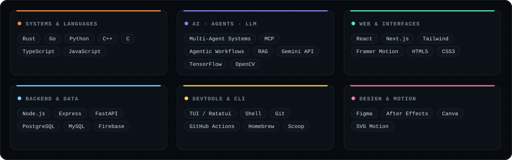
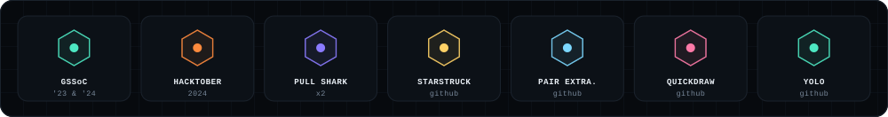

<!--
  ───────────────────────────────────────────────────────────────
  VesperAkshay · profile README
  All artwork in /assets is hand-authored SVG. Edit the colours in
  one place (gen.py) and regenerate if you ever want a new palette.
  ───────────────────────────────────────────────────────────────
-->

  

  
  
  
  
  

  

I build **low-level tools that people actually install.** Most of my week goes into
[DropWire](https://github.com/VesperAkshay/dropwire) — a peer-to-peer encrypted file-transfer
engine in Rust that skips the cloud entirely, using SPAKE2 for password-authenticated key exchange
and ChaCha20Poly1305 for the stream itself. The rest goes into **agent systems**: MCP clients,
multi-agent pipelines, and the plumbing that makes LLMs useful instead of impressive.

Before that I spent two summers in open source — **GSSoC '23 & '24** and **Hacktoberfest '24** —
which is also where my most-forked project came from: a QR generator that's now been forked
**97 times** by people building on top of it.

> **Currently:** shipping DropWire v0.1.x · exploring MCP tooling · deepening Rust + systems design
> **Open to:** internships, open-source collaboration, and anything with hard constraints

  

<table width="100%">
<tr>
<td width="50%" valign="top">

### ⚡ [DropWire](https://github.com/VesperAkshay/dropwire)
Zero-cloud, peer-to-peer **encrypted file transfer engine** in Rust. SPAKE2 PAKE handshake,
ChaCha20Poly1305 stream encryption, path-traversal hardening, and a TUI + headless CLI shipped
through Homebrew, Scoop and Cargo.

`Rust` · `Cryptography` · `P2P` · `TUI`
[**→ docs**](https://dropwire.tyes.dev) · [**→ write-up**](https://dev.to/vesperakshay/why-i-built-dropwire-no-more-cloud-no-more-waiting-ipk)

</td>
<td width="50%" valign="top">

### 🔳 [qr-code-generator](https://github.com/VesperAkshay/qr-code-generator)
Customisable QR builder with Firebase auth and stored history. My most-adopted project —
**39 stars, 97 forks**, and a common starting point for other people's builds.

`React` · `Firebase` · `JavaScript`
**⭐ 39 · 🍴 97**

</td>
</tr>
<tr>
<td width="50%" valign="top">

### 📦 [polypm](https://github.com/VesperAkshay/polypm)
A **polyglot package manager** that handles JavaScript and Python dependencies from a single
manifest — one lockfile, one command, two ecosystems.

`Rust` · `Package Management` · `CLI`

</td>
<td width="50%" valign="top">

### 🛰️ [reqsmith](https://github.com/VesperAkshay/reqsmith)
Command-line **API tester for REST and GraphQL** with response caching, reusable templates and
Gemini-powered request explanation.

`Python` · `CLI` · `Gemini API`

</td>
</tr>
<tr>
<td width="50%" valign="top">

### 🐝 [MCP-Hive](https://github.com/VesperAkshay/MCP-Hive)
A **unified MCP client** — one interface over many Model Context Protocol servers, with notes
documenting the architecture as it's built.

`Python` · `MCP` · `Agents`

</td>
<td width="50%" valign="top">

### 🧩 [lazynode](https://github.com/VesperAkshay/lazynode)
Terminal UI for **Node.js project management** — scripts, dependencies and package state without
leaving the keyboard. Distributed via Homebrew and Scoop.

`Go` · `TUI` · `DevTools`

</td>
</tr>
</table>

<b>&nbsp;More things I've built &nbsp;›</b>

 

| Project | What it is | Stack |
| :--- | :--- | :--- |
| [Linkedin-Post-Multi-agent](https://github.com/VesperAkshay/Linkedin-Post-Multi-agent) | Multi-agent pipeline that researches, drafts and refines LinkedIn posts | `Python` `Agents` |
| [Visual-Product-Matcher](https://github.com/VesperAkshay/Visual-Product-Matcher) | Image-similarity search over a product catalogue | `Python` `CV` |
| [File_Compression](https://github.com/VesperAkshay/File_Compression) | Compression utility built from the algorithms up | `Python` |
| [Tax-Planner-Finance](https://github.com/VesperAkshay/Tax-Planner-Finance) | Tax planning and projection tool | `Python` |
| [algo-visual](https://github.com/VesperAkshay/algo-visual) | Algorithm visualiser for the classics | `JavaScript` |
| [secureshare](https://github.com/VesperAkshay/secureshare) | Secure sharing experiment that fed into DropWire | `TypeScript` |
| [Open-Git](https://github.com/VesperAkshay/Open-Git) | Git workflow helper | `Go` |

  

  
  

  

  

 

  <b>If you're building something with sharp edges, I'd like to hear about it.</b> 
  Rust · agents · developer tooling · anything that ships to real users

  
  
  

  

  

  <i>Thanks for scrolling this far. Star something if it was useful.</i>

